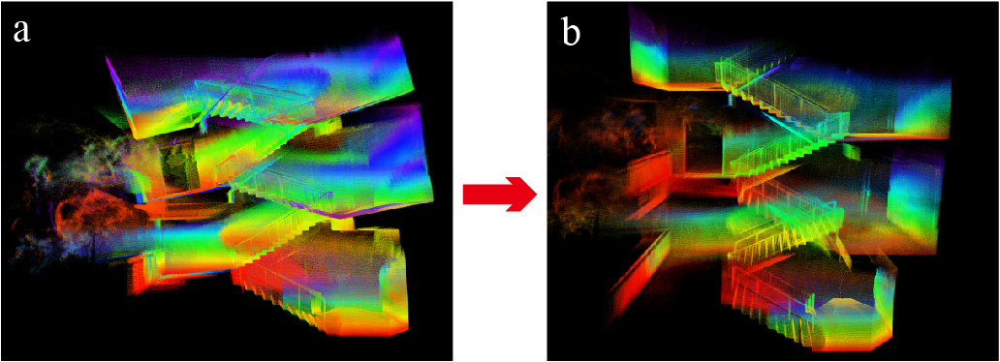
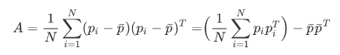

# BALM

## Bundle adjustment for lidar mapping

BALM is a basic and simple system to use bundle adjustment (BA) in lidar mapping. It uses an local BA and temporal sliding window to work in real-time. The code is simple with detailed notes and we do not add too many functions which may confuse you when reading the BALM. We will add motion blur, key frame and loop closure to make it a complete SLAM system in next version. The BALM is also a useful tool for multiple lidar calibration and SLAM. More experiment details can be found in the [video](https://youtu.be/d8R7aJmKifQ).

<div align="center">
    
    
</div>
In the development of our package, we reference to [A-LOAM](https://github.com/HKUST-Aerial-Robotics/A-LOAM), [Livox_mapping](https://github.com/Livox-SDK/livox_mapping), and [LeGO-LOAM](https://github.com/RobustFieldAutonomyLab/LeGO-LOAM) for source code or datasets. 

**Our related paper**: our related paper is available on Arxiv:

[BALM: Bundle Adjustment for Lidar Mapping](https://arxiv.org/abs/2010.08215)

## 1. Prerequisites

### 1.1 Ubuntu and ROS

Ubuntu 64-bit 16.04. [ROS Installation](http://wiki.ros.org/ROS/Installation) (Kinetic recommended)

### 1.2 PCL, OpenCV and Eigen

Follow [PCL Installation](https://pcl.readthedocs.io/projects/tutorials/en/latest/) (1.7 recommended). Follow [Eigen Installation](http://eigen.tuxfamily.org/index.php?title=Main_Page) (3.3.7 recommended). Follow [OpenCV Installation](https://opencv.org/releases/) (3.3.1 recommanded).

### 1.3 Livox Ros Driver

Follow [livox_ros_driver Installation](https://github.com/Livox-SDK/livox_ros_driver)

## 2. Build

Clone the repository and catkin_make:

```
    cd ~/catkin_ws/src
    git clone https://github.com/hku-mars/BALM.git
    cd ../
    catkin_make
    source ~/catkin_ws/devel/setup.bash
```

## 3. Run the package

### 3.1 Livox Horizon

Download [2020_parking_lot](https://connecthkuhk-my.sharepoint.com/:u:/g/personal/u3007335_connect_hku_hk/EZn7Mbj0VRNKpZZZ0D0DkW8Bttcr6RafwpjJCAaiOAykxw?e=COCVRq) and then

```
    roslaunch balm balm_horizon_outdoor.launch 
    rosbag play YOUR_DOWNLOADED.bag
```

### 3.2 Livox Mid-40

Download [hall_example](https://connecthkuhk-my.sharepoint.com/:u:/g/personal/u3007335_connect_hku_hk/EX4MPz6iorhNsT6CO-nHIgEBaz0_hMD9dqMZjPBmCJ5T9w?e=7Fiowm) and then

```
    roslaunch balm balm_mid40.launch
    rosbag play YOUR_DOWNLOADED.bag
```

### 3.3 VLP-16

Download [same_postion](https://connecthkuhk-my.sharepoint.com/:u:/g/personal/u3007335_connect_hku_hk/EbdqdFr6BuREuvKSE-49xNABAnJtiwTqxt-vfZPcK2Eu0Q?e=iQ8sRw) (provided by [LeGO-LOAM](https://github.com/RobustFieldAutonomyLab/LeGO-LOAM), you can also download by [same_position](https://drive.google.com/drive/folders/1hRcgDOKWl5jmYK2m66_ctx-91_eGneip)) and then

```
    roslaunch balm balm_velo16.launch
    rosbag play YOUR_DOWNLOADED.bag
```

### 3.4 LOAM as front-end

We also provide a version which uses LOAM as front-end and BALM as back-end like the figure 2 in the paper. Download [stairs](https://connecthkuhk-my.sharepoint.com/:u:/g/personal/u3007335_connect_hku_hk/EUauSzsnUiJCrP741WMh36kBQua3qtmNtI5FWH5HzAVkdg?e=mSRGJY) and then

```
    roslaunch balm balm_loam_horizon_indoor.launch
    rosbag play YOUR_DOWNLOADED.bag
```

## 4 Acknowledements

Thanks for LOAM (J. Zhang and S. Singh. LOAM: Lidar Odometry and Mapping in Real-time),  [A-LOAM](https://github.com/HKUST-Aerial-Robotics/A-LOAM), [Livox_mapping](https://github.com/Livox-SDK/livox_mapping), [Loam_livox](https://github.com/hku-mars/loam_livox) and [LeGO-LOAM](https://github.com/RobustFieldAutonomyLab/LeGO-LOAM). 

## 5 Appendix

Simplify covariance matrix

<div align="center">
    
</div>

