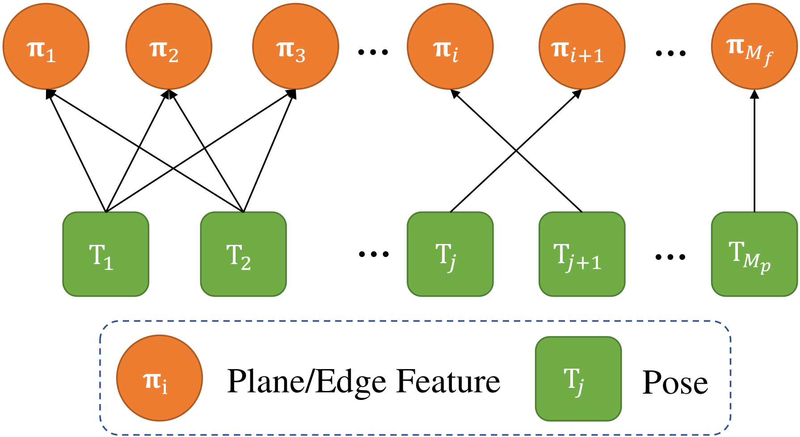

# BALM 2.0

## Efficient and Consistent Bundle Adjustment on Lidar Point Clouds

**BALM 2.0** is a basic and simple system to use bundle adjustment (BA) in lidar mapping. It includes three experiments in the paper. We try to keep the code as concise as possible, to avoid confusing the readers. It is notable that this package does not include the application experiments, which will be open-sourced in other projects. The paper  is available on Arxiv and more experiments details can be found in the [video](https://youtu.be/MDrIAyhQ-9E).

<div align="center">
    
</div>

**Related papers:** 

[Efficient and Consistent Bundle Adjustment on Lidar Point Clouds](https://arxiv.org/abs/2209.08854)

[BALM: Bundle Adjustment for Lidar Mapping](https://ieeexplore.ieee.org/abstract/document/9366383)

## 1. Prerequisited

### 1.1 Ubuntu and ROS

Ubuntu 64-bit 20.04.  [ROS Installation](http://wiki.ros.org/ROS/Installation). (Noetic recommended)

### 1.2 PCL and Eigen

Follow [PCL Installation](https://pointclouds.org/) (1.10 recommended)

Follow [Eigen Installation](https://eigen.tuxfamily.org/index.php?title=Main_Page) (3.3.7 recommended)

## 2. Build

Clone the repository and catkin_make:

```
cd ~/catkin_ws/src
git clone https://github.com/hku-mars/BALM
cd ../
catkin_make
source ~/catkin_ws/devel/setup.bash
```

**Note**: Before compilation, the file folder "BALM-old" had better be deleted if you do not require BALM1.0, or removed to other irrelevant path.

## 3. Run the package

### 3.1 Consistency experiments

```
roslaunch balm2 consistency.launch
```

### 3.2 Benchmark on virtual point cloud

```
roslaunch balm2 benchmark_virtual.launch
```

### 3.3 Benchmark on real-world dataset

```
roslaunch balm2 benchmark_realworld.launch
```

Due to the file size, other dataset will be uploaded to one drive later.

## 4. Applications

1. **Lidar-Inertial odometry with sliding window optimization**:  The codes will be open-sourced in the next work.
2. **Multiple-Lidar calibration**: More details can be seen [here](https://github.com/hku-mars/mlcc).
3. **Global BA on large-scale dataset**: More details can be seen [here](https://arxiv.org/pdf/2209.11939.pdf).

## 5. Acknowledgement

In the development of this package, we refer to [FAST-LIO2](https://github.com/hku-mars/FAST_LIO), [Hilti](https://www.hilti-challenge.com/), [VIRAL](https://ntu-aris.github.io/ntu_viral_dataset/) and [UrbanLoco](https://github.com/weisongwen/UrbanLoco) for source codes or datasets.

